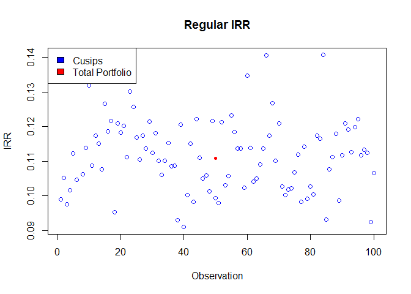
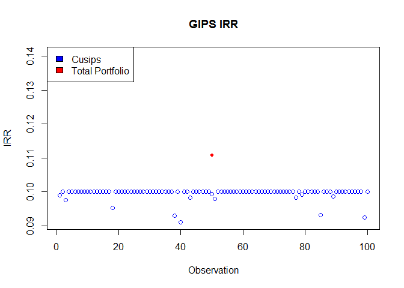

# GIPS compliant IRR demonstration
Karl Polen  
`r format(Sys.Date())`  

The Global Investment Performance Standards (GIPS) provides rules for reporting inception to date IRR calculations on investments.  Essentially, the rules require that for periods of less than one year, that returns not be annualized.  In practice, any IRR calculation requires specification of a compouding period, to which the IRR is calculated.  So, if you calculate annual IRRs they need to be scaled down to relevant time frame by taking the (1+IRR) to the power of the fraction of the annual period reflected in the cash flows.


We have updated our IRR algorithm to provide a GIPS compliant option.  Here is a simple example:


```r
cf=zoo(c(-1,1.1),as.Date(c("2013-1-1","2013-4-1")))
#the example cash has two items: -1 on Jan 1 and +1.1 on April 1
cf
```

```
## 2013-01-01 2013-04-01 
##       -1.0        1.1
```

```r
#the calculation of a regular IRR (same as XIRR in excel)
irr.z(cf)
```

```
## [1] 0.471877
```

```r
#now calculate as GIPS compliant
irr.z(cf,gips=TRUE)
```

```
## [1] 0.1000007
```
Normally an IRR can be thought of as the rate that value is accruing.  You can take that rate to the power of a time period and get an estimate of terminal wealth created.  The GIPS compliant IRR does not function that way for time periods less than a year.

Here is a simple example that illustrates how the two IRRs compare.  Suppose you have an investment opportunity that allows you to repeatedly invest in a security for $1 and it is guaranteed to pay $1.10 .   The only uncertainty is when you get paid.  Suppose the time for the payment is normally distributed with a mean of 330 days and a standard deviation of 30 days.  The following R program simulates a portfolio of 100 such investments and calculates the IRR for each of the investments and the total portfolio.  A scatter chart of IRRs is displayed.  The individual investments ("Cusips") are shown as blue circles and the total portfolio performance is shown as a red dot.

```r
#simulate the distribution of days (forcing any values < 1 to 1)
days=rnorm(100,mean=330,sd=30)
days[days<1]=1
firstday=as.Date("2013-1-1")
irr.reg=vector()
irr.gips=vector()
cf.tot=zoo(0,firstday)
for (i in days) {
  #make the cash flow
  cf.i=zoo(c(-1,1.1),c(firstday,firstday+i))
  #calculate the regular IRR
  irr.reg=c(irr.reg,irr.z(cf.i))
  #calculate the GIPS IRR
  irr.gips=c(irr.gips,irr.z(cf.i,gips=TRUE))
  #accumulate the portfolio cash flow
  cf.tot=mergesum.z(cf.tot,cf.i)
}
#calculate the portfolio IRRs
irr.port.reg=irr.z(cf.tot)
irr.port.gips=irr.z(cf.tot,gips=TRUE)
#Plot the regular IRRs
plot(1:100,irr.reg,col='blue',main='Regular IRR',xlab='Observation',ylab='IRR')
lines(50,irr.port.reg,type='p',pch=20,col='red')
legend('topleft',legend=c('Cusips','Total Portfolio'),fill=c('blue','red'))
```

<!-- -->

```r
#Plot the GIPS IRRs
plot(1:100,irr.gips,col='blue',main='GIPS IRR',xlab='Observation',ylab='IRR',ylim=range(irr.reg))
lines(50,irr.port.gips,type='p',pch=20,col='red')
legend('topleft',legend=c('Cusips','Total Portfolio'),fill=c('blue','red'))
```

<!-- -->

As you can see the GIPS method caps IRRs for investment with a duration less than a year at the 10% profit level.  The total portfolio ends up falling outside the range of reported GIPS IRRs because of this.  
